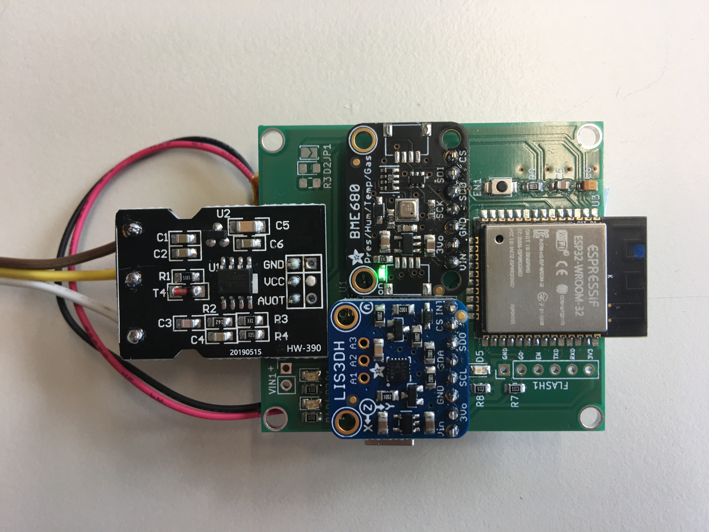
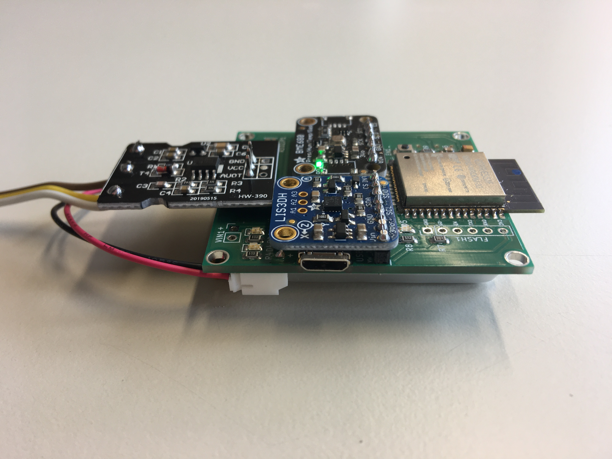
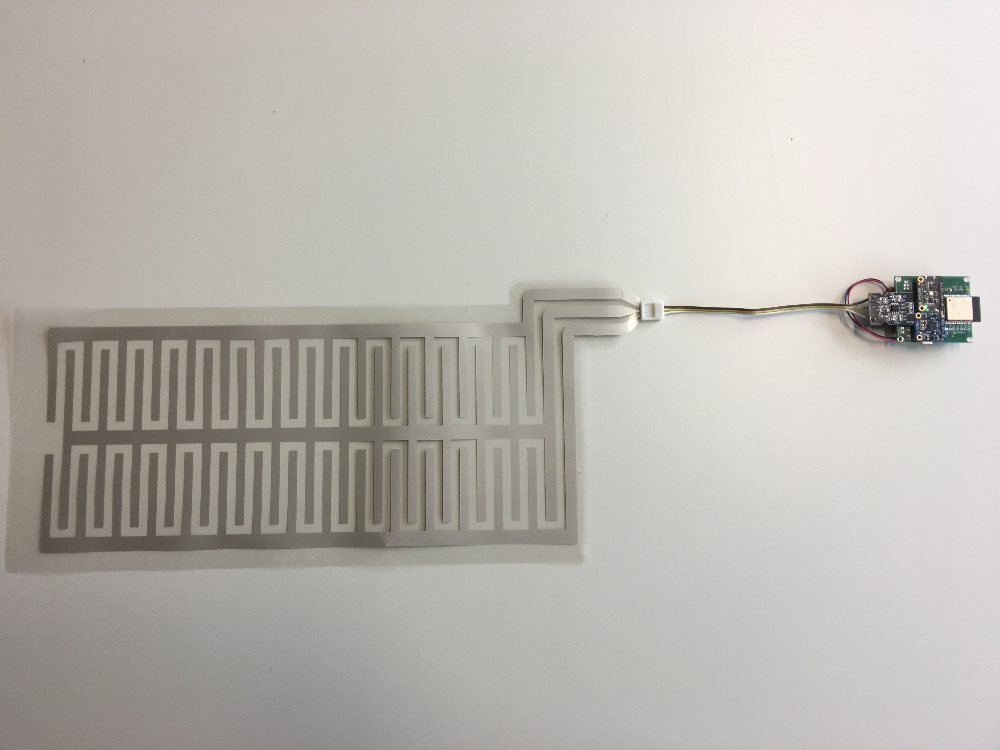
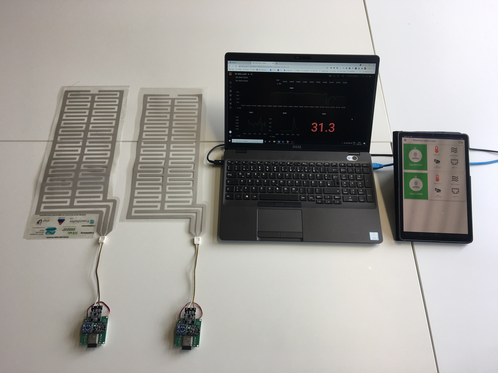

# PrintED

Readout device firmware for PrintED project

- Readout Device

Front                              |  Edge
:---------------------------------:|:--------------------------------------:
  | 

- Readout Device with PrintED Sensor



- System Deployment



## Compatibility

- [beuth-printed-sensor-hw](https://github.com/pdt590/beuth-printed-sensor-hw)
- [beuth-printed-app](https://github.com/pdt590/beuth-printed-app)
- [beuth-printed-cloud](https://github.com/pdt590/beuth-printed-cloud)

## Data Format Example

```json
{"id": "Clip-0001","temp": 100,"ax": 100,"ay": 100,"az": 100,"pres": 100,"hum": 100,"gas": 100,"alt": 100,"mois": 100}
```
